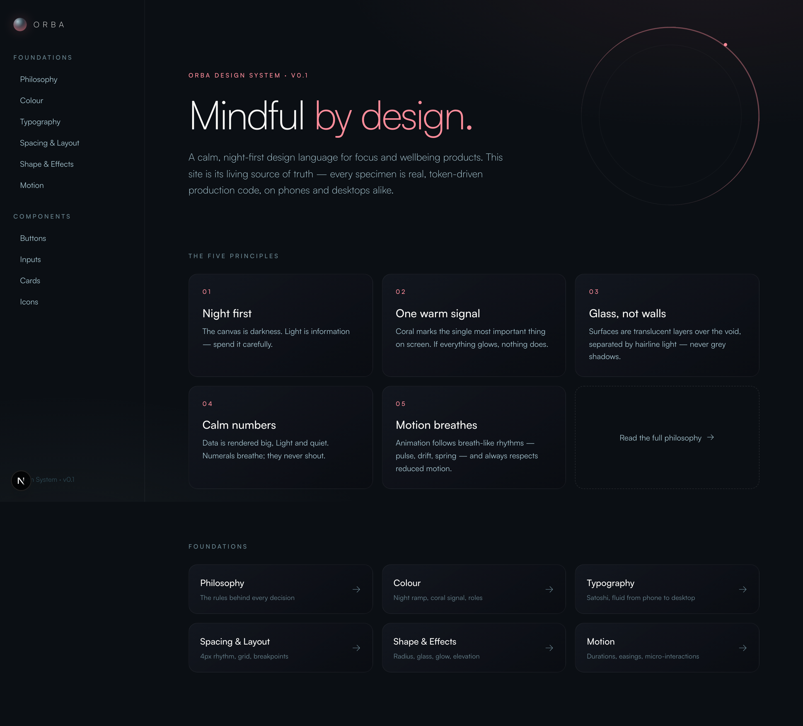

# ORBA Design System

**Mindful by design.** A calm, night-first design language for focus and wellbeing
products — built as a live, token-driven design system website.



ORBA started as a set of static concept images (see `design-refs/`) and was turned
into working code: every colour, size, radius, shadow and animation timing lives in
a small set of token files, and every specimen on the site is real production code
rendered from them.

## Highlights

- **Design tokens as the single source of truth** — DTCG-format JSON in `tokens/`,
  compiled to CSS variables + Tailwind v4 theme by `scripts/build-tokens.ts` (tested).
- **Foundations** — philosophy & rules, colour (with build-time contrast checks),
  fluid typography, spacing/breakpoints, glass & glow effects, motion tokens.
- **Components** — buttons, inputs (fields, select, checkbox/radio/toggle, sliders,
  segmented control), cards, and a curated icon set — every state documented live.
- **Motion library** — nine named micro-interactions with tokens, usage rules and
  `prefers-reduced-motion` fallbacks.
- **Figma bridge** — `figma-handoff/manifest.json` maps tokens → Figma variables and
  components → Figma component sets.

## Run it

```bash
pnpm install
pnpm dev
```

The first run downloads the Satoshi font from [Fontshare](https://www.fontshare.com/fonts/satoshi)
(its licence permits use but not redistribution, so the files aren't committed).

## Structure

```
tokens/            design tokens (source of truth, Figma-interchange format)
scripts/           token compiler, font fetcher, verification tooling
src/app/           the design-system site (Next.js App Router)
src/components/    orba/ = the component library · site/ = docs chrome
design-refs/       the original reference imagery the system was built from
figma-handoff/     generated manifest for mirroring into Figma
docs/              design doc, implementation plan, review screenshots
```

## Verification

```bash
pnpm test        # token pipeline
pnpm typecheck   # strict TS
pnpm build       # production build
pnpm tsx scripts/verify-inputs.ts <url>     # headless interaction checks
pnpm tsx scripts/capture-review.ts <url> <dir>  # full-page screenshot sweep
```

---

Built with [Claude Code](https://claude.com/claude-code). Satoshi typeface by the
Indian Type Foundry via Fontshare (Free Font Licence). Icons by
[Phosphor](https://phosphoricons.com/).
